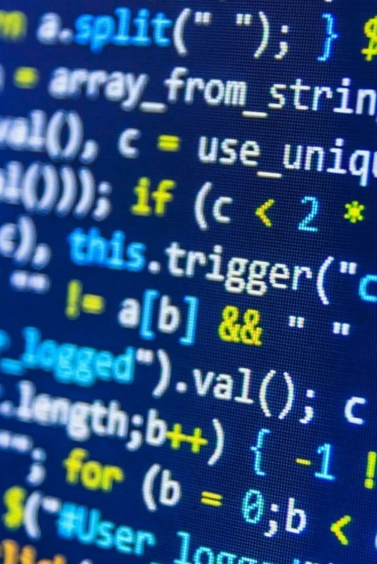
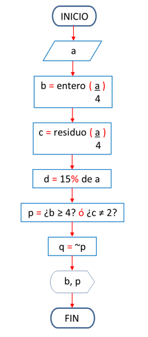
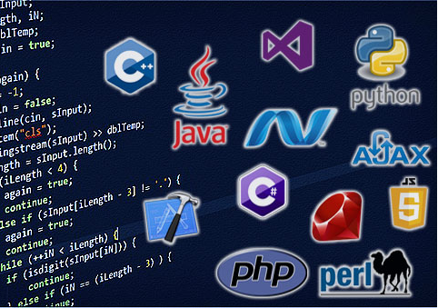
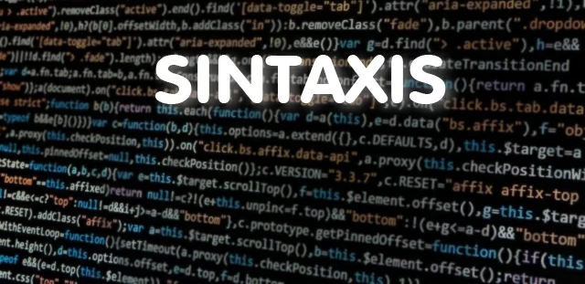
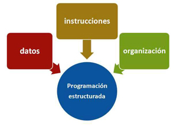
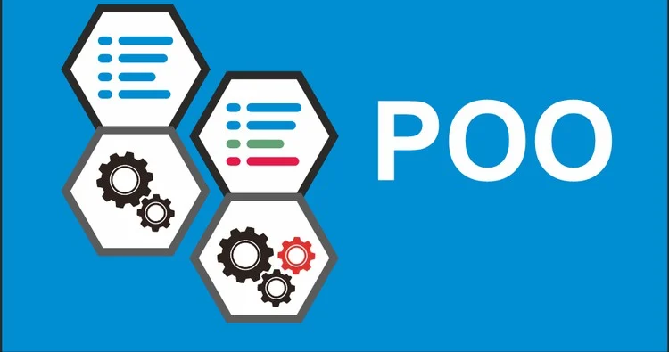
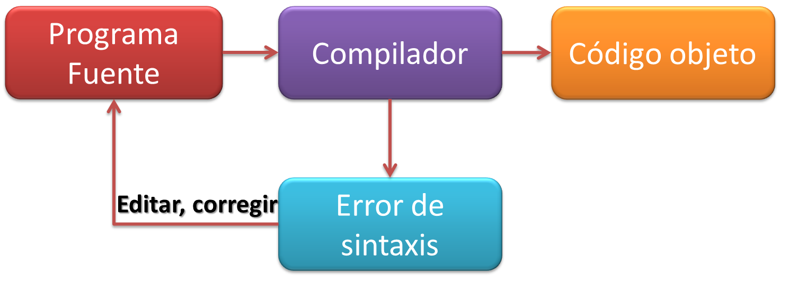

---
# try also 'default' to start simple
theme: seriph
# random image from a curated Unsplash collection by Anthony
# like them? see https://unsplash.com/collections/94734566/slidev
background: https://cdn.pixabay.com/photo/2024/05/21/19/58/code-8779051_1280.jpg
# some information about your slides (markdown enabled)
title: Compiladores
info: |
  ## Slidev Starter Template
  Presentation slides for developers.

  Learn more at [Sli.dev](https://sli.dev)
# apply UnoCSS classes to the current slide
class: text-left
# https://sli.dev/features/drawing
drawings:
  persist: false
# slide transition: https://sli.dev/guide/animations.html#slide-transitions
transition: slide-left
# enable MDC Syntax: https://sli.dev/features/mdc
mdc: true
# duration of the presentation
duration: 35min
---

# Compiladores
**Segundo parcial**

  Iniciar <carbon:arrow-right />

  <button @click="$slidev.nav.openInEditor()" title="Open in Editor" class="slidev-icon-btn">
    <carbon:edit />
  </button>
  <a href="https://github.com/slidevjs/slidev" target="_blank" class="slidev-icon-btn">
    <carbon:logo-github />
  </a>

---
transition: fade-out
layout: two-cols
layoutclass: gap-10
---

# ¿Qué veremos hoy?

  

    01
    Introducción y objetivos
  

  

    02
    ¿Qué es la programación?
  

  

    03
    Primeros pasos
  

  

    04
    Tipos de lenjuage de programación
  

  

    05
    Tipos de operadores y datos
  

  

    06
    La importancia de la sintaxis
  

::right::

 

  

---
transition: fade-out
class: text-center
---

<h1 class="font-800 tracking-[-0.5px] m-0 mb-6" style="color:#0A56A3;">
  Introducción y objetivos
</h1>

  

    La programación: es el proceso de crear instrucciones para que una computadora realice tareas específicas, dividiendo un problema grande en una serie de pasos lógicos y ordenados, conocidos como algoritmos.
  

  

    

      
Objetivo 1

      
Saber los <strong>conceptos básicos de programación</strong>.

    

    

      
Objetivo 2

      
Conocer los <strong>tipos de lenjuage de programación</strong>.

    

    

      
Objetivo 3

      
Explicar como funcionan los <strong>operadores</strong> y los tipos.

    

    

      
Objetivo 4

      
Aprenderse <strong>los tipos de datos</strong> que existen en la programación.

    

    

      
Objetivo 5

      
Conocer <strong>la sintaxis de cada lenjuage</strong> que utilizan.

    

    

      
Objetivo 6

      
poder dominar los <strong>distintos lenjuages</strong> de programación.

    

  
 

---
transition: fade-out
class: text-center
---

<h1 class="font-800 tracking-[-0.5px] m-0 mb-6" style="color:#0A56A3;">
  ¿Qué es la programación?
</h1>

  

    La programación es el proceso de dar instrucciones a una computadora para que realice tareas específicas.
Esas instrucciones se escriben en un lenguaje de programación, como Python, Java, C++, JavaScript, etc.
  

  

    

      
Consepto más a fondo

      
Es simplemente darle órdenes a una computadora para que haga lo que tú quieras, así como le dirías a alguien “enciende la luz” o “abre la puerta”; en este caso, le dices a la computadora “muestra un mensaje”, “suma estos números” o “guarda este dato”.

La diferencia es que la computadora no entiende español, por eso usamos lenguajes especiales llamados lenguajes de programación, como Python, JavaScript o C++.

    

    

  

  
 

---
transition: fade-out
class: text-center
---

<h1 class="font-600 tracking-[-0.1px] m-0 mb-3" style="color:#0A56A3;">
  Primeros pasos
</h1>

  

    Los pseudocódigos y diagramas de flujo existen porque ayudan a planear y entender un programa antes de escribirlo en un lenguaje de programación.
  

  

    

      
Pseudocódigo:

      
es una forma de escribir los pasos de un algoritmo usando un lenguaje parecido al humano, pero con una estructura lógica similar a la programación.

<strong>Diagramas de flujo:</strong>

son representaciones gráficas de un algoritmo mediante figuras y flechas que muestran el orden de las operaciones; permiten visualizar el proceso de manera clara y sencilla.

<strong>-Ambos ayudan a diseñar, analizar y comprender cómo funcionará un programa antes de programarlo.</strong>

    

    

  

  
 

---
transition: fade-out
class: text-center
---

<h1 class="font-800 tracking-[-0.5px] m-0 mb-6" style="color:#0A56A3;">
  Tipos de lenjuage de programación
</h1>

  

    Un lenguaje de programación es un sistema de instrucciones que permite comunicarse con la computadora para crear programas, aplicaciones o sistemas que realicen tareas específicas.
  

  

    

  

      
Tipos que existen

      
<strong>Bajo nivel:</strong> cercanos al hardware, muy rápidos pero difíciles (Ej. Assembly).

<strong>Medio nivel:</strong> combinan potencia y control (Ej. C).

<strong>Alto nivel:</strong> fáciles de entender y usar (Ej. Python, Java, C++).

<strong>Web:</strong> crean páginas y sitios web (Ej. HTML, CSS, JavaScript).

<strong>Scripting:</strong> automatizan tareas (Ej. Python, Bash, Ruby).

<strong>Especializados:</strong> usados en áreas específicas (Ej. SQL, R, MATLAB).

    

  
 

---
transition: fade-out
class: text-center
---

<h1 class="font-800 tracking-[-0.5px] m-0 mb-6" style="color:#0A56A3;">
  Tipos de operadores y datos
</h1>

  

    Lo que tienen en común los tipos de datos y los operadores es que ambos son elementos básicos de la programación y trabajan juntos para procesar información dentro de un programa.

Los tipos de datos indican qué clase de información se está usando (números, texto, verdadero o falso), mientras que los operadores sirven para realizar acciones o cálculos con esa información. En resumen, los datos son lo que se usa y los operadores son lo que se hace con ellos.
  

      
Tipos de Operadores

      
Los operadores son símbolos que se usan para realizar operaciones con los datos, como sumar, comparar o asignar valores. Existen diferentes tipos: los aritméticos, los relacionales, los lógicos y los de asignación.

    

    

      
Tipos de Datos

      
Los tipos de datos son las diferentes clases de información que puede manejar una computadora, como números, textos o valores lógicos. Sirven para que el programa sepa qué tipo de dato está usando y cómo debe tratarlo.

    

  
 

---
transition: fade-out
class: text-center
---

<h1 class="font-600 tracking-[-0.1px] m-0 mb-3" style="color:#0A56A3;">
  La importancia de la sintaxis
</h1>

  

    La sintaxis es importante porque establece las reglas que determinan cómo deben escribirse correctamente las instrucciones en un lenguaje de programación, permitiendo que la computadora las entienda y las ejecute sin errores; si la sintaxis se usa mal, el programa no funcionará correctamente o no podrá ejecutarse.
  

 
  

    

  

  
 

---
transition: fade-out
layout: two-cols
layoutclass: gap-10
---

# Siguentes lecciones

  

    01
    Tipos de programación
  

  

    02
    programación estructurada
  

  

    03
    programación orientada a objetos
  

  

    04
    programación funcional
  

  

    05
    programación lógica
  

  

    06
    Tipos de compiladores
  

::right::

  

---
transition: fade-out
class: text-center
---

<h1 class="font-600 tracking-[-0.5px] m-0 mb-6" style="color:#0A56A3;">
  Tipos de programación
</h1>

  

    Existen varios tipos de programación porque cada uno está diseñado para resolver diferentes tipos de problemas y adaptarse a distintas formas de pensar y trabajar.por eso existen algunos necesitan rapidez, otros organización, precisión matemática o ejecución simultánea (como estructurado, orientado a objetos o funcional).
  

  

    

      
Estructurada:

      
organiza el código en bloques con secuencias, condicionales y bucles.

    

    

      
orientada a objetos:

      
usa clases y objetos para modelar elementos del mundo real.

    

    

      
funcional:

      
se basa en funciones matemáticas y evita modificar datos.

    

    

      
lógica:

      
utiliza reglas y hechos para deducir conclusiones.

    

    

      
declarativa:

      
se enfoca en qué se quiere hacer, no en cómo hacerlo.

    

    

      
concurrente:

      
permite ejecutar varias tareas al mismo tiempo.

    

  
 

---
transition: fade-out
class: text-center
---

<h1 class="font-600 tracking-[-0.1px] m-0 mb-3" style="color:#0A56A3;">
  Programación estructurada
</h1>

  

    La programación estructurada es una forma de escribir programas de manera ordenada y lógica, dividiendo el código en partes o bloques que se ejecutan de forma secuencial, con decisiones y repeticiones controladas. Su propósito es mejorar la claridad, reducir errores y facilitar el mantenimiento del programa al evitar el desorden y el uso excesivo de saltos como “goto”.
  

 
  

    

  

  
 

---
transition: fade-out
class: text-center
---

<h1 class="font-600 tracking-[-0.1px] m-0 mb-3" style="color:#0A56A3;">
  Programación orientada a objetos
</h1>

  

    La programación orientada a objetos (POO) es un tipo de programación que organiza el código en objetos, los cuales representan cosas del mundo real y contienen atributos (datos) y métodos (acciones). Su objetivo es hacer que el código sea más fácil de entender, reutilizar y mantener, ya que permite crear programas basados en la interacción entre objetos, siguiendo principios como herencia, encapsulamiento y polimorfismo.
  

 
  

    

  

  
 

---
transition: fade-out
class: text-center
---

<h1 class="font-600 tracking-[-0.1px] m-0 mb-3" style="color:#0A56A3;">
  Programación funcional
</h1>

  

    La programación funcional es un tipo de programación que se basa en el uso de funciones matemáticas para resolver problemas, evitando cambiar datos o usar variables globales. En este enfoque, el resultado de una función depende solo de sus entradas, lo que hace el código más predecible, fácil de probar y mantener. Se enfoca en qué se quiere hacer, más que en cómo hacerlo, y es común en lenguajes como Haskell, Lisp o Scala.
  

 
  

    

  

  
 

---
transition: fade-out
class: text-center
---

<h1 class="font-600 tracking-[-0.1px] m-0 mb-3" style="color:#0A56A3;">
  Programación lógica
</h1>

  

    La programación lógica es un tipo de programación que se basa en el razonamiento y las reglas lógicas para resolver problemas. En lugar de indicar paso a paso qué hacer, el programador define hechos y reglas, y el programa utiliza la lógica para deducir conclusiones o respuestas. Este tipo de programación se usa mucho en inteligencia artificial y sistemas expertos, y un lenguaje común para aplicarla es Prolog.
  

 
  

    

  

  
 

---
transition: fade-out
class: text-center
---

<h1 class="font-600 tracking-[-0.1px] m-0 mb-3" style="color:#0A56A3;">
  Tipos de compiladores
</h1>

  

    Existen varios tipos de compiladores, entre los principales están: el compilador de una sola pasada, que traduce el código en un solo recorrido; el compilador de varias pasadas, el compilador cruzado, el intérprete, y el compilador JIT (Just In Time), que combina compilación e interpretación para optimizar la ejecución en tiempo real.
<strong>
    ¡ESTO FUE CREADO CON COMPILADORES!</strong>

  

 
  

    

  

  
 

---
layout: center
class: text-center
---

# Gracias por su atención

[Inicio](http://localhost:3030/1) · [¿Qué veremos hoy?](http://localhost:3030/2) · [Siguientes lecciones](http://localhost:3030/9)

<PoweredBySlidev mt-10 />
